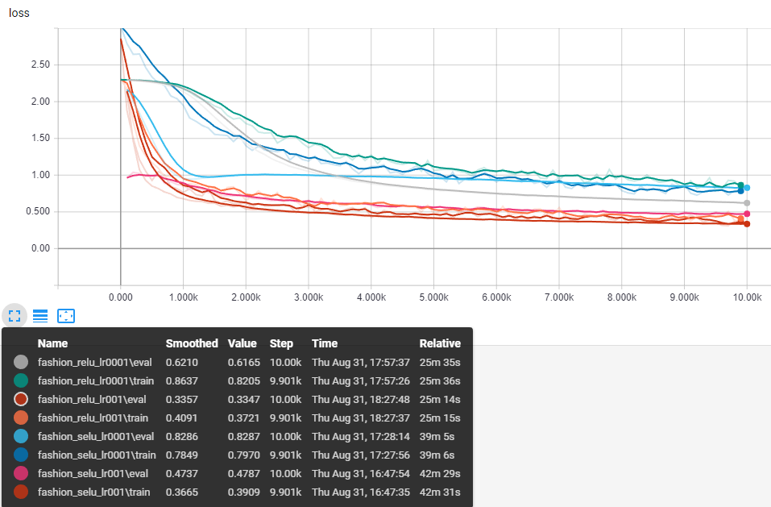
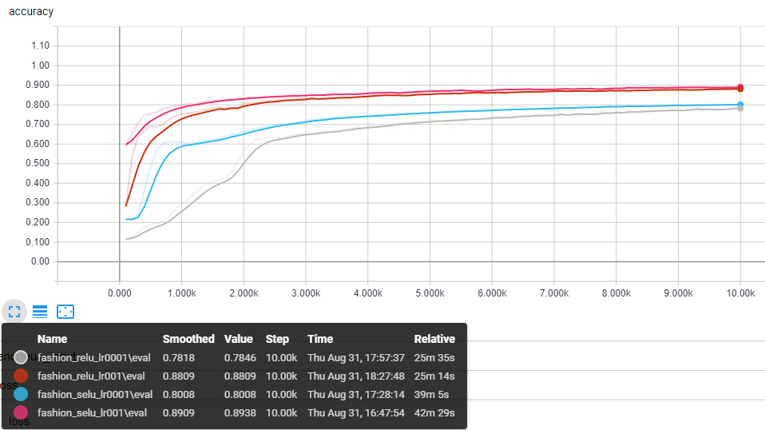

# fashion-mnist
Little experiments on fashion-mnist dataset with tensorflow.
All results were produced without data preprocessing or augmentation and stopped after 100 epochs. The code of SELU activation function were borrowed from [bioinf-jku](https://github.com/bioinf-jku/SNNs)'s implementation.

## The CNN architecture
C(3,32)-C(3,32)-P2-C(3,64)-C(3,64)-P2-FC64-FC64-S10

## Results
|Activation|Learning Rate|MNIST|Fashion MNIST|
|---|---|---|---|
|RELU|0.01|0.9874|0.8809|
|RELU|0.001|0.9388|0.7818|
|SELU|0.01|0.9871|0.8938|
|SELU|0.001|0.9490|0.8008|

## Curves
### Fashion-MNIST (Loss)

### Fashion-MNIST (Accuracy)

### MNIST (Loss)

### MNIST (Accuracy)

